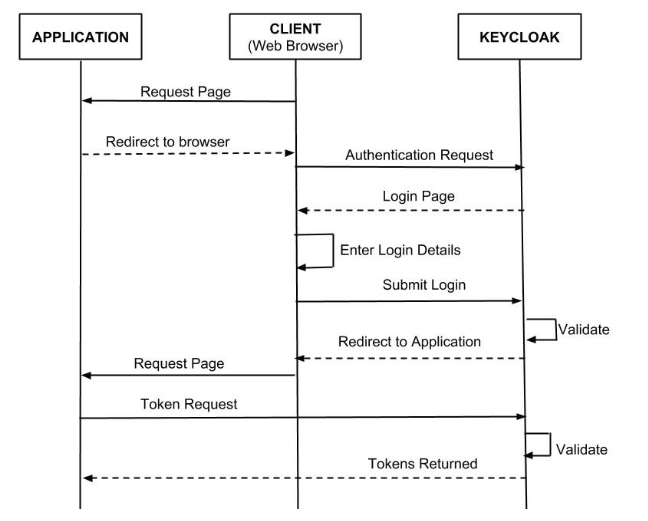

# Keycloak - A Identity and Access Management Tool

Keycloak is a tool which is developed by RedHat to provide identity and access management at a central place. The main objective of creating this repo was to give a quick overview of keycloak and how can we integrate with multiple DevOps tools.

## Requirments
- [X] **[Docker](https://docs.docker.com/install/overview/)**
- [X] **[Docker Compose](https://docs.docker.com/compose/install/)**

## Supported Integrations

There is n number of integration which is supported by keycloak but we are providing examples for only some of the DevOps tools. The example integration which are available are below:-

- **[Sonar](./keycloak-sonar)**
- **[Kibana](./keycloak-kibana)**
- **[Grafana](./keycloak-grafana)**

## Keycloak Architecture

The keycloak architecture looks like this:-



## Directory Structure Overview

```text
keycloak
├── images              ---> Store images for README and docs
├── keycloak-grafana    ---> Stores keycloak integration setup for Grafana
│   ├── config
│   └── grafana
├── keycloak-kibana     ---> Stores keycloak integration setup for Kibana
│   ├── config
│   └── kibana
└── keycloak-sonar      ---> Stores keycloak integration setup for SonarQube
    ├── config
    └── sonarqube
```

## How to Use?

Clone this repo
```shell
git clone git@gitlab.com:ot-middleware/keycloak.git
```

Then please refer to these docs for setting up this lab:-

- **Sonar** - For sonar keycloak integration setup refer [here](./keycloak-sonar/README.md)
- **Kibana** - For kibana keycloak integration setup refer [here](./keycloak-kibana/README.md)
- **Grafana** - For grafana keycloak integration setup refer [here](./keycloak-grafana/README.md)
