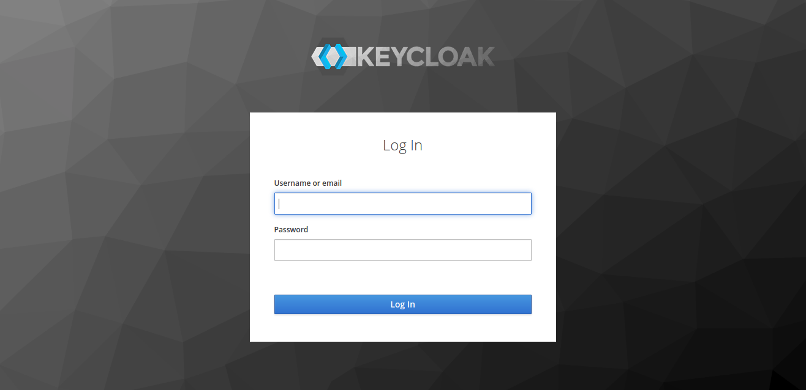
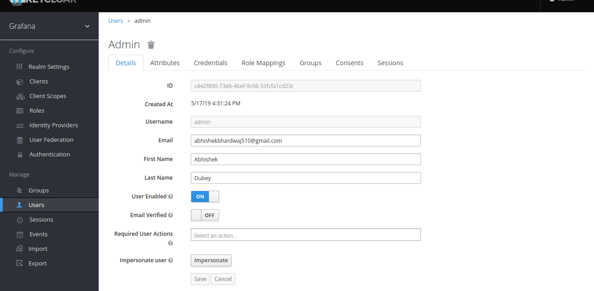
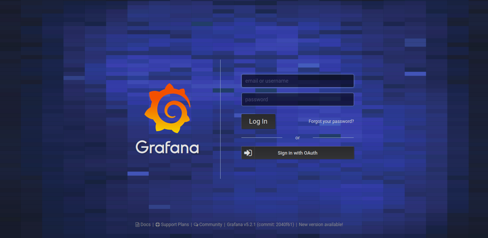
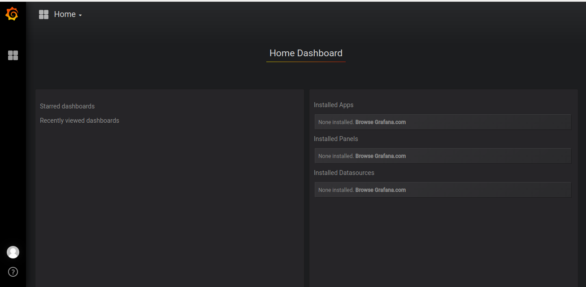

# Keycloak Integration with Grafana

The good thing about keycloak and grafana integration is that we don't have to install any kind of plugin because grafana by default supports OAUTH2(OpenID).

## How to setup?

There are not hell lot of pre-requisites but yes there is some. Let's divide it step by step.

#### First thing that we have to do is to edit [grafana.ini](./grafana/grafana.ini)

```ini
[auth.generic_oauth]
enabled = true
name = OAuth
allow_sign_up = true
client_id = grafana
auth_url = http://<server_ip>:8080/auth/realms/Grafana/protocol/openid-connect/auth
token_url = http://<server_ip>:8080/auth/realms/Grafana/protocol/openid-connect/token
api_url = http://<server_ip>:8080/auth/realms/Grafana/protocol/openid-connect/userinfo
```

Replace the *server_ip* with your IP.

#### After this we can build the image and create the setup.

```shell
docker-compose build
docker-compose up -d
```

#### Once all things are up, login in keycloak with default creds, Username:- admin Password:- password, url of keycloak would be http://<your_server_ip>:8080.



#### Create a user in you keycloak server like this.



#### After creating user try opening grafana, the default url would be http://<server_ip>:3000. It will redirect you to keycloak SSO page.



#### After putting credentials of created user you will get your grafana login like this.


