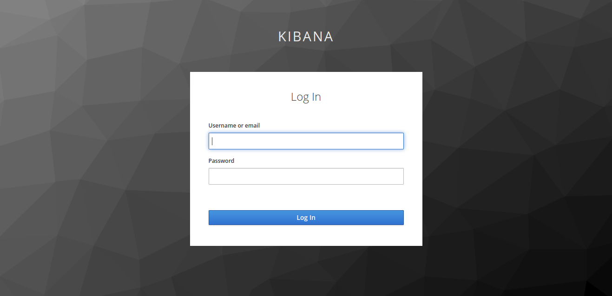
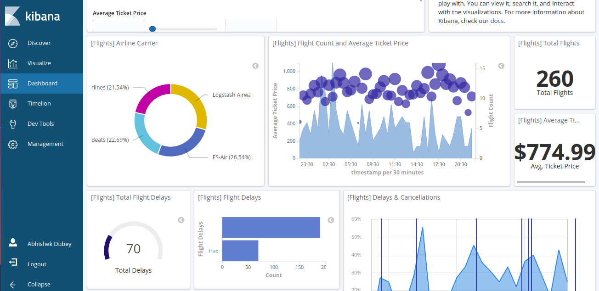

# Keycloak Integration with Kibana

For integrating keycloak with kibana we are using a plugin here. You can refer **[this](https://github.com/novomatic-tech/keycloak-kibana)** plugin page for more info.

## How to setup?
Setup is quite simple, just put this command in your terminal after clonning repo.

```shell
cd keycloak-kibana
docker-compose up -d
```

Other than this there is no further steps except to login. We already have created 4 users in keycloak for testing.

#### Open up the kibana dashboard on http://<server_ip>:5601. It will redirect you to keycloak page like this



#### You can login in kibana with 4 different accounts and all accounts will have different permissions.

|**Username**|**Password**|
|------------|------------|
|admin|admin|
|user1|user1|
|user2|user2|
|user3|user3|

#### After login your magical kibana dashboard will look like this


