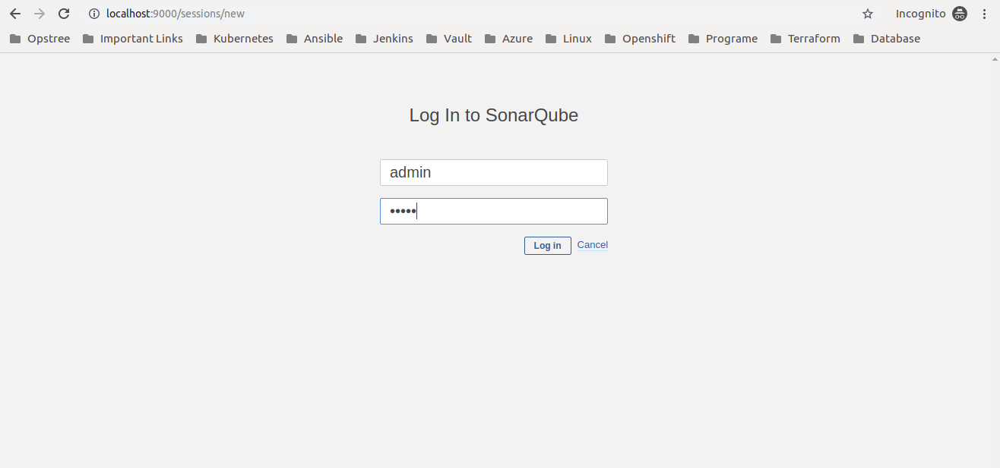
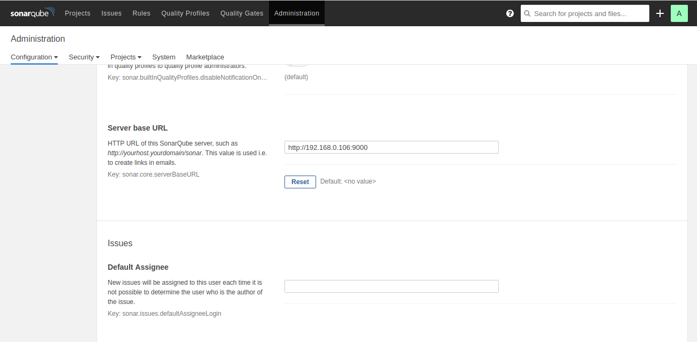
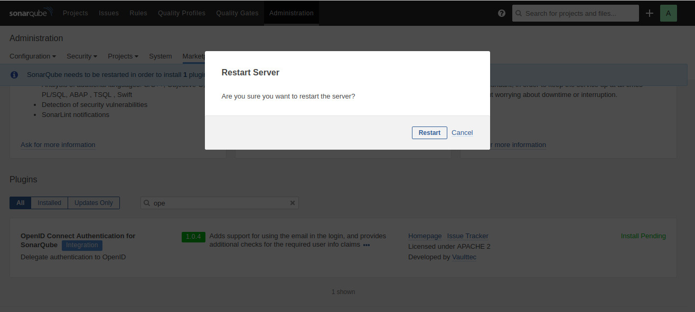
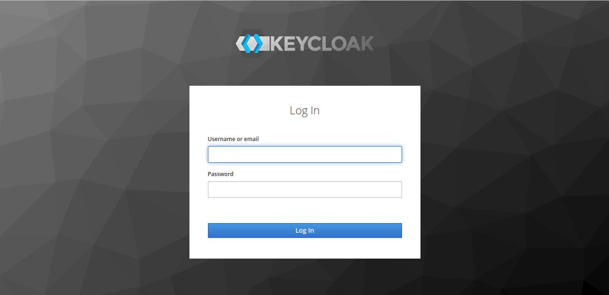
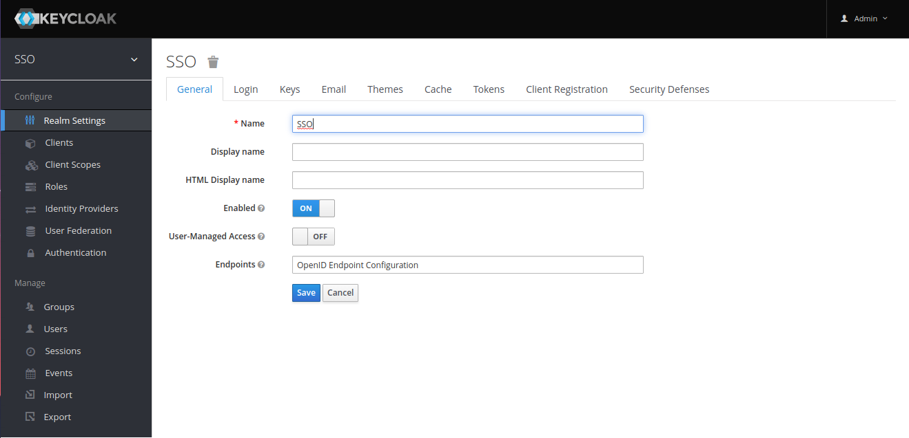
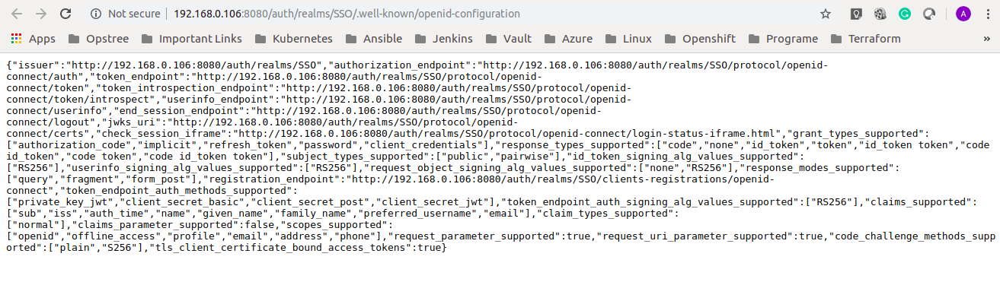
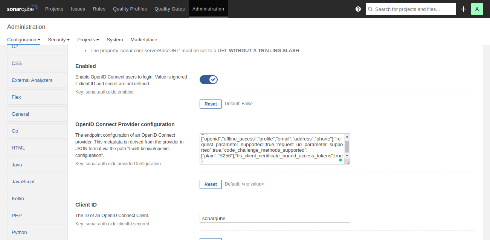
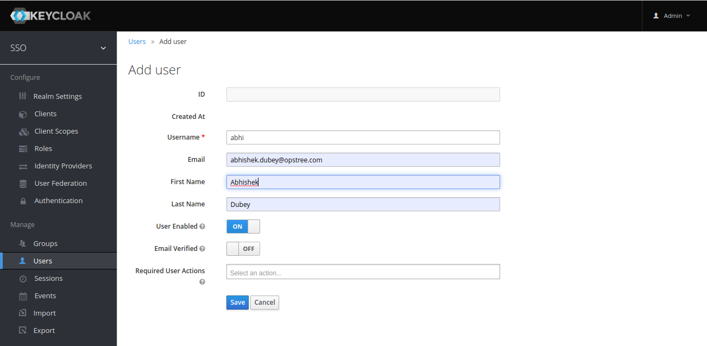

# Keycloak Integration with Sonar
Keycloak doesn't directly integrates with **Sonarqube**. For integration we will use OIDC which is supported by keycloak.

## How to setup?
Setup is quite simple, just put this command in your terminal after clonning repo.

```shell
cd keycloak-sonar
docker-compose up -d
```

There are not hell lot of pre-requisites but yes there is some. Let's divide it step by step.

#### Step 1:- Login in sonarqube with default creds, Username:- admin Password:- admin, url of sonar would be http://<your_server_ip>:9000.



#### Step 2:- Go to Administration -> Configuration -> General Settings and configure the sonar server base url.



#### Step 3:- Go to Administration -> Marketplace and install the plugin for OpenID.


#### Step 4:- Restart the sonar server for completing plugin installation.



#### Step 5:- Login in keycloak with default creds, Username:- admin Password:- password, url of keycloak would be http://<your_server_ip>:8080.



#### Step 6:- You will directly login in SSO realm, just click on OpenID Endpoint Configuration.



#### Step 7:- It will open a new tab with content like below, just copy the whole content.



#### Step 8:- Go to Administration -> Configuration -> Security and make these changes.



#### Step 9:- Create a user in you keycloak server like this.



#### Step 10:- Now try to login in sonar using OpenID with user created by keycloak.


